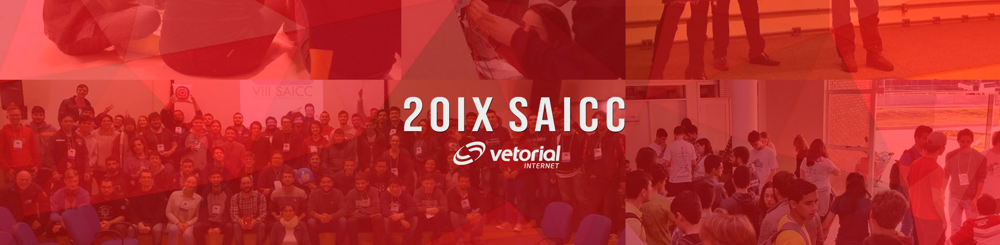

Website development for the IX Semana Acadêmica das Ciências Computacionais (SAICC), event at Federal University of Rio Grande

## Built With
* HTML5
* CSS3
* Javascript Language
* [Bootstrap](https://getbootstrap.com/) - Framework

## Last Version

**Aug 2019 / 3.6 Version** is stable

## Authors
* **Adornete Martins** - [@adornetejr](https://github.com/adornetejr)
* **Jorge Siqueira** - [@jorgsiq](https://github.com/jorgsiq)

See also the list of [contributors](https://github.com/jorgsiq/saicc-website/graphs/contributors) who participated in this project

## License

This project is licensed under the MIT License - see the [LICENSE.md](LICENSE.md) file for details

